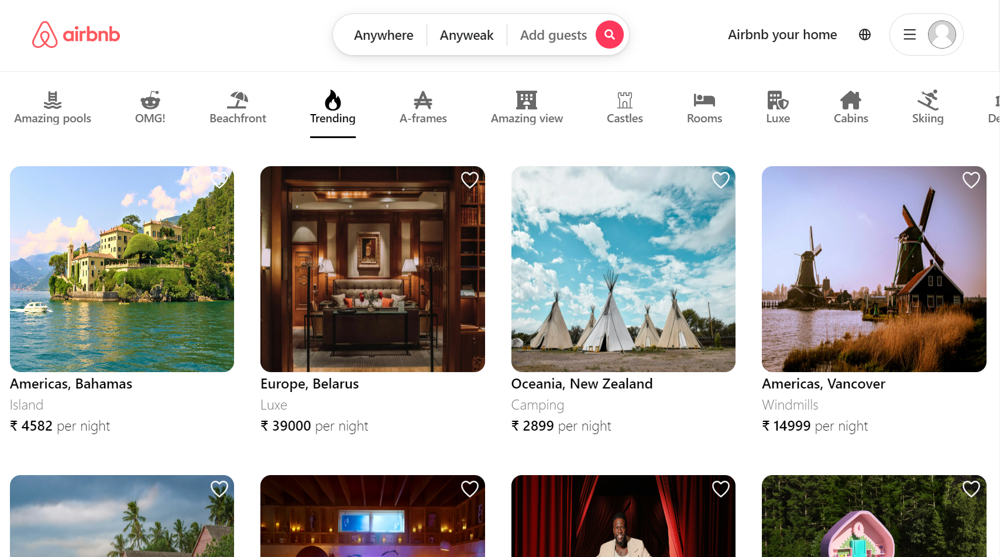
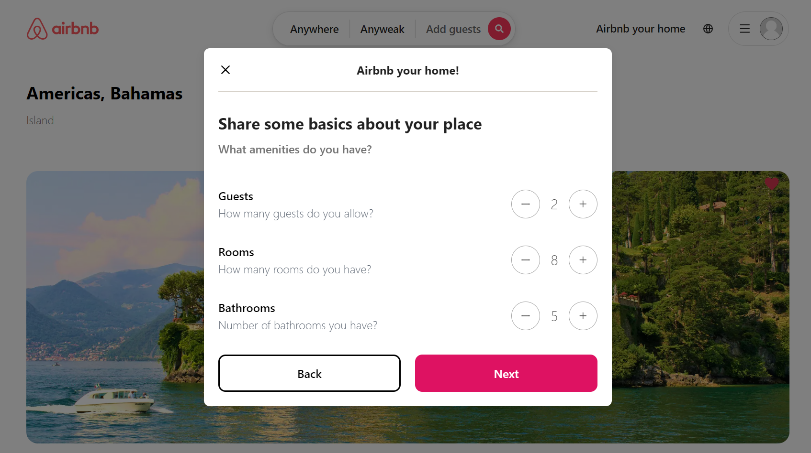

# 🌟 Airbnb Clone


Welcome to the **Airbnb Clone** project! This application is a modern, responsive front-end clone of the popular Airbnb platform, built using **Next.js 14**, **React**, and **pure CSS**. This project demonstrates a strong understanding of front-end development principles, responsive design, and state management.




## 🛠️ Key Features

- **Seamless Navigation**: Utilizes **Next.js 14** routing for smooth transitions between pages.
- **Responsive Design**: Optimized for various devices and screen sizes, ensuring a great user experience on mobile, tablet, and desktop.
- **User-Friendly Interface**: Clean and intuitive UI, making it easy for users to navigate the application.
- **Favorites Functionality**: Users can save their favorite listings with a simple click.
- **Detailed Property Listings**: Each property includes detailed information, images, and user reviews.

## 📚 Packages Used

1. **Next.js 14** 🚀
   - **Purpose**: A React framework for server-rendered applications, providing a seamless development experience.
   - **Key Features**: 
     - File-based routing
     - Automatic code splitting for faster page loads
     - Server-side rendering capabilities for better SEO


2. **React Hook Form** 📋
   - **Purpose**: Simplifies form handling in React applications.
   - **Key Features**: 
     - Easy integration with various form validation libraries
     - Optimized for performance by minimizing re-renders


3. **Redux Toolkit** 📦
   - **Purpose**: A powerful library for managing global state in applications.
   - **Key Features**: 
     - Simplifies state management with a structured approach
     - Includes powerful middleware for handling async actions and side effects


4. **React-Select** 🎛️
   - **Purpose**: A flexible and customizable dropdown component.
   - **Key Features**: 
     - Allows for complex selections, including multi-select and async options
     - Easily styled to match the application's design


5. **react-date-range** 📅
   - **Purpose**: A date range picker for selecting check-in and check-out dates.
   - **Key Features**: 
     - Highly customizable and user-friendly interface


6. **react-icons** 🎨
   - **Purpose**: Provides a set of icons to enhance the UI.
   - **Usage**: Icons are used throughout the application to visually represent actions and improve user interaction.


7. **world-countries** 🌍
   - **Purpose**: A package to provide country data for various functionalities.
   - **Usage**: Used to enable country selection features in forms.


## 🖼️ Project Screenshots

Here are some screenshots of the application. (Add your images here)
 
# Listing Creation 
**Choose Category**


**Choose Country or Place in Map**


**Choose Country**


**No. if Rooms,Bathrooms,Guests**



**Upload Property Image**


**Title and Description of Property**


**Single Property Image**


**Login Model**


**Register Model**


**MacBook Air**


**Single Propery MackBook Air**


**Galaxy Fold**


**Galaxy Fold Single Property Image**


**IPhone 13 Pro**


**IPhone 13 Pro Single Property**


**IPhone 5**


## 🏗️ Instructions for Using the Project

### Clone the Repository

```bash
git clone https://github.com/sahilTiwariiii/Airbnb-Clone
```

### Install Dependencies

```bash
cd Airbnb-Clone
npm install
```

### Running the Development Server

To start the development server, run:

```bash
npm run dev
```

Open your browser and go to: [http://localhost:3000](http://localhost:3000)

## ⚠️ Important Notes

- This project is a **frontend-only** application without a backend.
- While all features are designed for a seamless user experience, functionalities like booking or user authentication are simulated for demonstration purposes.

## 🌐 Live Demo

You can access the live version of the Airbnb Clone here: [🌐 Live Demo](https://your-live-demo-link.com)

## 💼 Conclusion

The **Airbnb Clone** project showcases my skills in modern web development using **Next.js**, **React**, and **CSS**. With a focus on performance, responsiveness, and user experience, this project serves as a strong example of my capabilities as a frontend developer.

## 🛑 Disclaimer

This project does not include a backend service, and all data is static. The use of libraries is aimed at enhancing the user experience and interface without compromising the core functionalities of the application.

